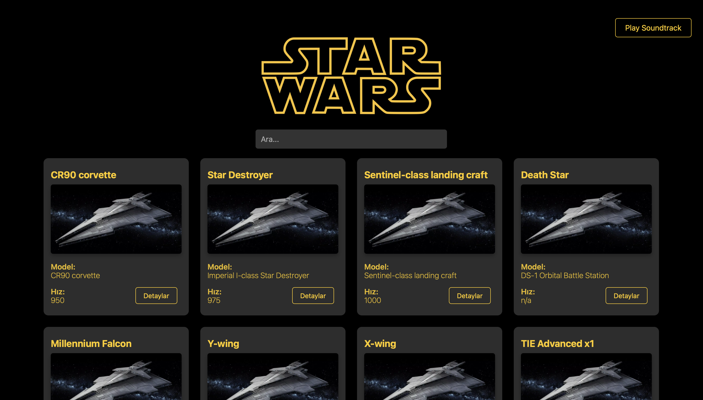
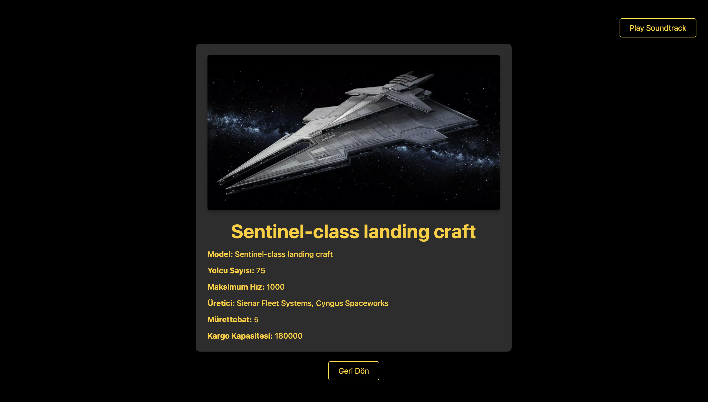
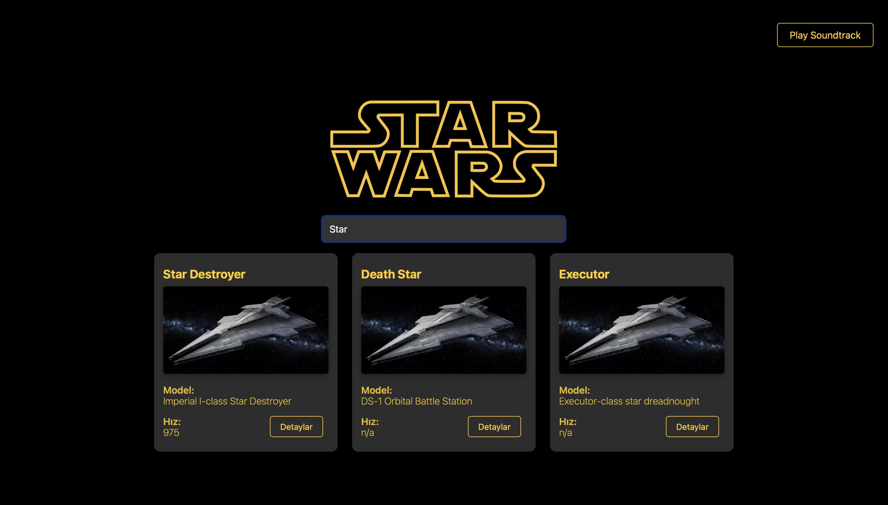

# Star Wars Starship Explorer

This project is a mini application that lists Star Wars starships, allows you to view their details, and includes a Star Wars soundtrack. Users can search among starships, load more items, and view detailed information for each starship.

**[Demo Link](https://peaceful-scone-b010b5.netlify.app)**

## Features

- **Starship List**: Displays a list of starships using data fetched from the Star Wars API.
- **Search Function**: Allows searching starships by name or model.
- **Detail Page**: Clicking on a starship shows detailed information such as name, model, passenger capacity, speed, manufacturer, etc.
- **Load More**: Button to load more starships step-by-step, displaying 8 starships per page.
- **Music Player**: Play or pause the Star Wars soundtrack.

## Technologies Used

- **React**: Used for building the UI.
- **Axios**: Used for making API requests.
- **Star Wars API**: Used to fetch starship data.
- **CSS**: Used for styling.

## Installation

### Requirements

- Node.js and npm should be installed.

### Steps

1. Clone this repository:
   ```bash
   git clone https://github.com/ozgurdayanir/starwars-app.git
   ```
2. Navigate into the project directory:
   ```bash
   cd starwars-app
   ```
3. Install dependencies:
   ```bash
   npm install
   ```
4. Run the application:
   ```bash
   npm run dev
   ```

## Usage

- **Listing**: On opening the page, the first 8 Star Wars starships are displayed.
- **Searching**: Use the search box to filter starships by name or model. Search results are limited to 8 items.
- **Load More**: Click on 'Load More' to expand the list with additional starships.
- **Detail Page**: Click on a starship in the list to view more detailed information.
- **Soundtrack**: Click the "Play Soundtrack" button to start the Star Wars music, and "Pause Soundtrack" to stop it.

## API

**API link:** https://swapi.dev

- **/starships**: Fetches the list of starships.

## Screenshots

### Home Page


### Detail Page


### Searching



## License

This project is licensed under the MIT License. See the `LICENSE` file for more details.
